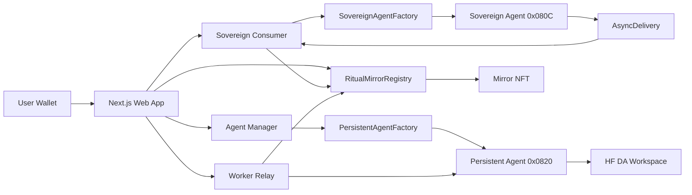

# Architecture

## Lifecycle

1. The frontend prepares identity input and checks RitualWallet state.
2. The user submits a Genesis request.
3. The Sovereign Agent creates a strict `MirrorProfile`.
4. The callback updates registry state.
5. The app prepares DA workspace files for the Persistent Agent.
6. The user spawns the persistent launcher.
7. Registry stores the launcher/workspace reference.
8. NFT mint links token ID to the mirror owner.
9. Worker surfaces status, history, and chat relay endpoints.

## State Boundaries

- On-chain: ownership, lifecycle, profile hash, metadata URI, DA workspace URI, genesis job ID, persistent launcher.
- DA: profile JSON, agent prompt, memory seed, history, artifacts.
- Worker: event indexing, chat relay, status cache.
- Browser: forms, wallet connection, lifecycle UI.

## Factory-Backed Agent Path

The official Ritual dApp skills recommend factory-backed contract harness/launcher mode for production:

- `SovereignAgentFactory -> SovereignAgentHarness`
- `PersistentAgentFactory -> PersistentAgentLauncher`

Ritual Mirror contracts currently expose lifecycle storage and event surfaces. The exact factory launch parameter packing should be implemented from the official examples before testnet launch.
